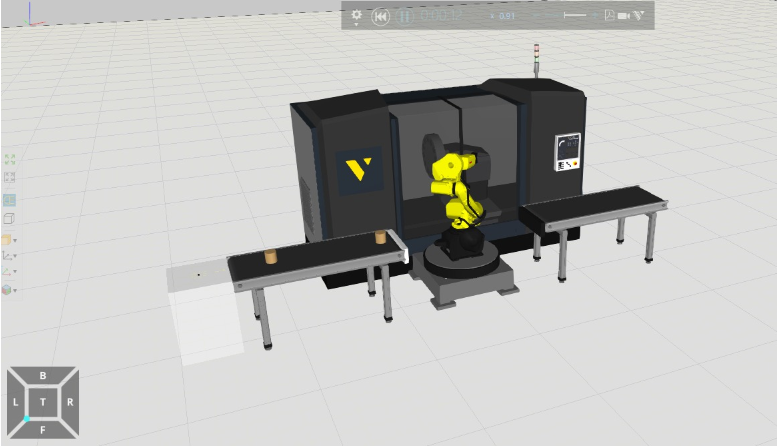
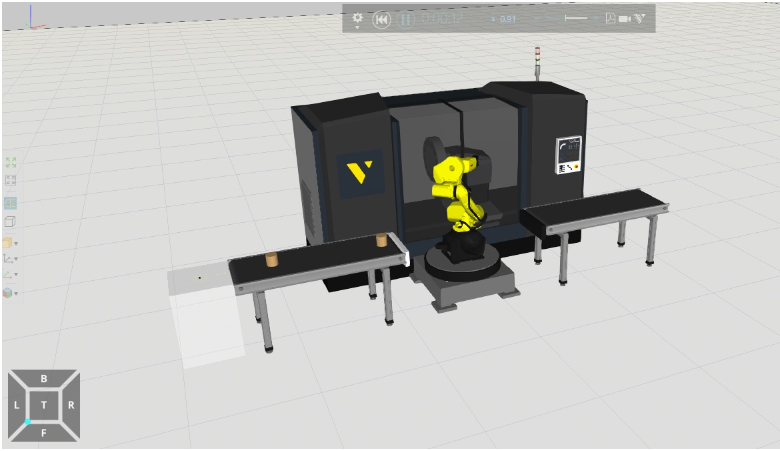
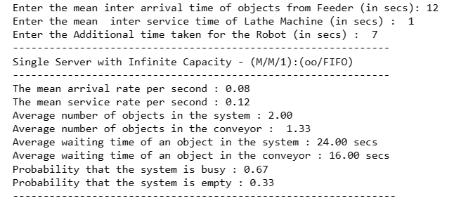

## SINGLE SERVER WITH INFINITE CAPACITY(M/M/1):(oo/FIFO)
## AIM:
To find (a) average number of materials in the system (b) average number of materials in the conveyor (c) waiting time of each material in the system (d) waiting time of each material in the conveyor, if the arrival  of materials follows Poisson process with the mean interval time 12 seconds, service time of lathe machine follows exponential distribution with mean service time 1 second and average service time of robot is 7seconds.

## SOFTWARE REQUIRED:
Visual components and Python.

## THEORY:
Queuing is the most frequently encountered problems in everyday life. For example, queue at a cafeteria, library, bank, etc. Common to all of these cases are the arrivals of objects requiring service and the attendant delays when the service mechanism is busy. Waiting lines cannot be eliminated completely, but suitable techniques can be used to reduce the waiting time of an object in the system. A long waiting line may result in loss of customers to an organization. Waiting time can be reduced by providing additional service facilities, but it may result in an increase in the idle time of the service mechanism.


This is a queuing model in which the arrival is Markovian and departure distribution is also Marovian,number of server is one and size of the queue is also Markovian, no.of server is one and size of the queue is infinite and service discipline is 1st come 1st serve(FCFS) and the calling source is also finite.

## PROCEDURE:


## EXPERIMENT:



 
## PROGRAM:
```
NAME : PAARKAVY B
REG NO : 212221230072
```

```
arr_time = float(input("Enter the mean inter arrival time of objects from Feeder (in secs): "))
ser_time = float(input("Enter the mean  inter service time of Lathe Machine (in secs) :  "))
Robot_time = float(input("Enter the Additional time taken for the Robot (in secs) :  "))
lam = 1/arr_time
mu = 1/(ser_time+Robot_time)
print("--------------------------------------------------------------")
print("Single Server with Infinite Capacity - (M/M/1):(oo/FIFO)")
print("--------------------------------------------------------------")
print("The mean arrival rate per second : %0.2f "%lam)
print("The mean service rate per second : %0.2f "%mu)
if (lam <  mu):
    Ls = lam/(mu-lam)
    Lq = Ls-lam/mu
    Ws = Ls/lam
    Wq = Lq/lam
    print("Average number of objects in the system : %0.2f "%Ls)
    print("Average number of objects in the conveyor :  %0.2f "%Lq)
    print("Average waiting time of an object in the system : %0.2f secs"%Ws)
    print("Average waiting time of an object in the conveyor : %0.2f secs"%Wq)
    print("Probability that the system is busy : %0.2f "%(lam/mu) )
    print("Probability that the system is empty : %0.2f "%(1-lam/mu) )
else:
    print("Warning! Objects Over flow will happen in the conveyor")
print("---------------------------------------------------------------")
```

## OUTPUT:


## RESULT:
The average number of materials in the system and in the conveyor and waiting time are successfully found.

